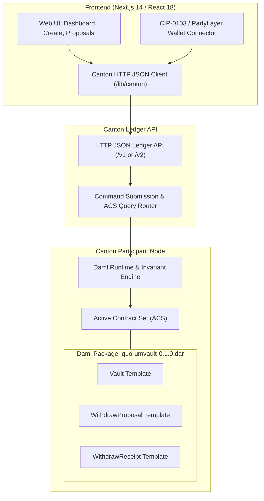

# QuorumVault

**QuorumVault** is an *m-of-n* threshold-governed treasury and custody smart contract built in Daml for the **Canton Network** as part of **HackCanton Season 3** (BitSafe *Decentralizing Apps on Canton* track).

> **One-Sentence Description**: QuorumVault decentralizes custody on Canton by requiring an *m-of-n* cryptographic quorum of authorized operators to approve and execute any treasury withdrawal on-chain.

- **Live Application Demo**: [https://quorumvault.vercel.app/](https://quorumvault.vercel.app/) *(Hosted interface; testnet/devnet demo)*
- **HackCanton DevNet Status**: **Live & Verified (2-of-2 Multi-Operator Quorum)**
- **DAR Package ID**: `c8ac685dd4671ced2983869ef6a118d9698a4280db05fd0e6eef6a67cacdf249`

---

## Table of Contents

1. [Project Overview](#project-overview)
2. [Example Walkthrough](#example-walkthrough)
3. [Core Security Model](#core-security-model)
4. [Transaction Lifecycle](#transaction-lifecycle)
5. [Live DevNet Verification](#live-devnet-verification)
6. [System Architecture](#system-architecture)
7. [Smart Contracts](#smart-contracts)
8. [Testing & Verification](#testing--verification)
9. [Local Development](#local-development)
10. [Network Configuration & DevNet Status](#network-configuration--devnet-status)
11. [Frontend Application](#frontend-application)
12. [Zero-Mock Policy](#zero-mock-policy)
13. [HackCanton Season 3 Context](#hackcanton-season-3-context)
14. [Limitations & Roadmap](#limitations--roadmap)
15. [Repository Structure](#repository-structure)
16. [Quick Verification Checklist](#quick-verification-checklist)
17. [Troubleshooting](#troubleshooting)
18. [Security & Operational Notes](#security--operational-notes)
19. [License](#license)

---

## Project Overview

### The Problem

In single-custodian architectures, protocol treasuries, DAO funds, and application balances rely on a single private key or participant identity. A single compromised credential, key leak, or rogue operator can unilaterally drain all protocol assets. Even with off-chain approval procedures, the underlying ledger permits a single signature to execute catastrophic state transitions.

### The Solution

**QuorumVault** eliminates single points of failure by moving custody governance directly into Daml smart contracts on the Canton Network. In QuorumVault:
- A treasury vault is parameterized with $n$ authorized operator parties and an approval threshold $m$ ($1 \le m \le n$).
- No single operator can unilaterally transfer or withdraw assets.
- Outflow proposals must be created on-ledger, independently confirmed by distinct operators until the threshold $m$ is satisfied, and then atomically executed.
- Every successful withdrawal generates an immutable on-chain `WithdrawReceipt` containing cryptographic audit proofs.

### Why Threshold Governance Matters

Decentralizing custody is the first line of defense for digital asset treasuries:
- **Collusion Resistance**: An attacker must compromise at least $m$ independent operational identities before any fund movement can occur.
- **Operator Separation**: Routine operations can proceed smoothly with $m$ active keys even if $n - m$ operators are unavailable or offline.
- **Rate-Limiting & Policy Enforcement**: Contracts enforce a strict maximum single-withdrawal ceiling (`maxSingleWithdrawal`), preventing large unauthorized drains even if a momentary quorum is reached.

### Why Canton and Daml

Canton and Daml provide unique architectural primitives ideal for multi-party custody:
- **Sub-Transaction Privacy & ACS**: Only the vault owner and authorized operators have visibility into proposals, confirmations, and balances. Unrelated parties on the Canton network have zero visibility.
- **Contract-Enforced Authorization**: In Daml, authorization is strictly checked by the Daml runtime engine via signatories, observers, and choice controllers. The frontend is never trusted as a security boundary.
- **Atomic State Transitions**: Archiving the executed proposal, debiting the treasury vault, and creating the immutable receipt happen in a single atomic transaction. Partial execution is mathematically impossible.

---

## Example Walkthrough

The following 2-of-3 threshold scenario illustrates the tested Daml behavior (verified via Daml Script tests, not fabricated production transactions):

```text
Participants: Alice, Bob, Carol (n = 3 Operators)
Threshold:    m = 2
Vault Asset:  CBTC
Initial State: Balance = 100.0 CBTC, MaxSingle = 50.0 CBTC

1. PROPOSAL STAGE:
   Alice proposes a withdrawal:
     - Recipient: SupplierParty
     - Amount: 10.0 CBTC
     - Memo: "Q3 Infrastructure Payment"
   State after proposal:
     - Vault Balance: 100.0 CBTC (Completely untouched)
     - WithdrawProposal Created on-ledger: Confirmations = [Alice] (1 of 2)

2. UNDER-THRESHOLD EXECUTION ATTEMPT (Rejected):
   Alice attempts to execute the withdrawal immediately.
   Result: REJECTED by Daml runtime.
   Assertion: "Threshold not met: insufficient confirmations" (1 < 2)
   Vault Balance: 100.0 CBTC (Untouched)

3. CONFIRMATION STAGE:
   Bob reviews the proposal on-ledger and exercises ConfirmWithdrawal.
   State after confirmation:
     - WithdrawProposal Updated on-ledger: Confirmations = [Bob, Alice] (2 of 2)
     - Threshold satisfied: length (dedup confirmations) >= 2

4. ATOMIC EXECUTION STAGE:
   Alice exercises ExecuteWithdrawal on the Vault contract.
   Atomic on-ledger transition:
     - Old Vault Contract: Archived
     - WithdrawProposal Contract: Archived (cannot be replayed)
     - New Vault Contract Created: Balance = 90.0 CBTC (100.0 - 10.0)
     - WithdrawReceipt Contract Created:
         Amount: 10.0 CBTC
         Recipient: SupplierParty
         Confirmations: [Bob, Alice]
         RemainingBalance: 90.0 CBTC
```

---

## Core Security Model

**The Daml contract is the sole security boundary.** Authorization and state transitions are strictly governed by the Canton ledger engine, not client-side JavaScript or UI guards:

```text
┌────────────────────────────────────────────────────────┐
│                   Daml Runtime Engine                  │
├──────────────────────────┬─────────────────────────────┤
│ Invariant Guarantee      │ Daml Implementation         │
├──────────────────────────┼─────────────────────────────┤
│ m-of-n Threshold         │ length (dedup confirmations)│
│                          │   >= threshold              │
├──────────────────────────┼─────────────────────────────┤
│ Operator Restriction     │ proposer `elem` operators   │
│                          │ executor `elem` operators   │
│                          │ operator `elem` operators   │
├──────────────────────────┼─────────────────────────────┤
│ Single-Withdrawal Limit  │ amount <= maxSingleLimit    │
├──────────────────────────┼─────────────────────────────┤
│ Balance Solvency         │ amount <= balance           │
├──────────────────────────┼─────────────────────────────┤
│ No Double-Confirmation   │ operator `notElem` confs    │
├──────────────────────────┼─────────────────────────────┤
│ Anti-Replay              │ archive proposalCid         │
├──────────────────────────┼─────────────────────────────┤
│ Immutable Audit Trail    │ create WithdrawReceipt      │
└──────────────────────────┴─────────────────────────────┘
```

1. **Threshold Enforcement**: A withdrawal can **only** execute if the number of unique operator confirmations is at least `threshold`.
2. **Controller Boundaries**: Only parties designated in `operators` can propose, confirm, execute, or cancel withdrawals. Unauthorized parties (e.g. `Eve`) are rejected by Daml assertions.
3. **Anti-Replay & Double-Execution**: Upon execution, the `WithdrawProposal` is immediately archived. An archived contract ID cannot be referenced or re-executed.
4. **No Double-Confirmation**: An operator cannot confirm the same proposal multiple times to artificially fabricate a quorum (`operator notElem confirmations`).
5. **Rate-Limiting**: Proposals exceeding `maxSingleWithdrawal` fail validation immediately at proposal time and execution time.
6. **Immutable Audit Trail**: Every executed withdrawal atomically mints a `WithdrawReceipt` contract recording the recipient, amount, confirmations, and remaining balance.

---

## Transaction Lifecycle

```text
     ┌──────────────┐
     │ CREATE VAULT │  owner allocates Vault contract with m-of-n rules
     └──────┬───────┘
            │
            ▼
     ┌──────────────┐
     │   PROPOSE    │  authorized operator proposes withdrawal (amount, recipient)
     └──────┬───────┘  balance remains 100% untouched
            │
            ├───────────────┐ (insufficient confirmations: length < m)
            │               ▼
            │        [ EXECUTE FAILS ] -> submitMustFail / rejected by Daml
            │
            ▼
     ┌──────────────┐
     │   CONFIRM    │  second / subsequent operator adds confirmation
     └──────┬───────┘
            │
            ▼ (threshold met: length >= m)
     ┌──────────────┐
     │   EXECUTE    │  operator triggers atomic execution
     └──────┬───────┘
            │
            ├──> Vault debited (balance = balance - amount)
            ├──> WithdrawProposal archived (no replay)
            └──> WithdrawReceipt minted on Canton ACS
```

---

## Live DevNet Verification

> **DevNet Status**: QuorumVault is live and verified on HackCanton DevNet. A real 2-of-2 withdrawal has been executed using two independent Canton parties. The ledger rejected execution at 1/2 approvals and permitted execution only after the second operator confirmed.
>
> *(Note: This demonstrates verified testnet/devnet smart contract operation on the Canton Network. It is not a claim of production/mainnet deployment, real-world customer funds, or commercial treasury usage.)*

### Verified 2-of-2 Lifecycle Summary

A complete multi-operator withdrawal lifecycle was executed and verified on the live HackCanton DevNet Canton ledger:

- **Network**: HackCanton DevNet (Participant: `https://ledger-api-json.participant.hackcanton-01.devnet.naas.noders.services`)
- **Package ID**: `c8ac685dd4671ced2983869ef6a118d9698a4280db05fd0e6eef6a67cacdf249` (admitted and vetted on DevNet)
- **Verified Vault**:
  - **Vault ID**: `devnet-qv-2of2-57ddfd37`
  - **Initial Balance**: `100.0 CBTC`
  - **Threshold**: `2-of-2`
  - **Authorized Operators**: Two distinct Canton operator parties (`Operator 1` and `Operator 2`), each authenticated with independent Keycloak credentials
  - **Maximum Single Withdrawal**: `25.0 CBTC`
- **Verified Withdrawal Lifecycle**:
  - **Amount**: `10.0 CBTC`
  - **Proposal Creation**: Proposed by Operator 1; initially recorded with `1/2` confirmations on-ledger.
  - **Under-Threshold Rejection (1/2)**: An attempted execution with only `1/2` confirmations was rejected by the Daml contract runtime with:
    `DAML_FAILURE: "Threshold not met: insufficient confirmations"`
  - **Second-Operator Confirmation (2/2)**: Operator 2 subsequently confirmed the withdrawal using distinct bearer credentials, recording `2/2` confirmations on-ledger.
  - **Successful Execution (2/2)**: With the 2-of-2 threshold satisfied, the withdrawal executed atomically on-chain.
  - **Balance Debited**: Vault balance transitioned from `100.0 CBTC` to `90.0 CBTC`.
  - **Audit Receipt Created**: A real on-chain `WithdrawReceipt` was minted recording the `10.0 CBTC` withdrawal, `90.0 CBTC` remaining balance, and both operator signers.
  - **Proposal Consumed**: The `WithdrawProposal` contract was consumed and archived upon execution (preventing replay attacks).
- **Ledger ACS Verification**:
  - Direct Active Contract Set (ACS) query at ledger offset `2194723` verified:
    - Active `Vault` contract present at `90.0 CBTC`
    - Active `WithdrawReceipt` present on-ledger
    - Executed `WithdrawProposal` archived and no longer active

For complete transaction update IDs, contract IDs (CIDs), command IDs, and raw ledger diagnostics, see the full audit trail in [**docs/REAL-2OF2-DEVNET-VERIFICATION.md**](docs/REAL-2OF2-DEVNET-VERIFICATION.md).

---

## System Architecture



### Architectural Components

1. **Daml Smart Contracts (`daml/`)**:
   - `Vault.daml`: The core production contract defining `Vault`, `WithdrawProposal`, and `WithdrawReceipt`.
   - `QuorumVault.daml`: An alternative protocol variant exploring custodian-governed architectures.
   - `Test.daml`: In-depth security test suite verifying all 7 lifecycle invariants.
   - `QuorumVaultTest.daml`: Test suite verifying the `QuorumVault` variant.
   - `Demo.daml`: LocalNet script for initializing demo parties and contracts.
2. **Frontend Layer (`frontend/`)**:
   - Next.js 14 App Router with React 18 and Tailwind CSS.
   - Strict TypeScript typechecking with zero `any` evasions on contract interfaces.
   - CIP-0103 / PartyLayer-compatible party switching and wallet connection.
3. **Canton Ledger API Client (`frontend/lib/canton/` & `frontend/lib/vault/`)**:
   - Direct integration with Canton HTTP JSON Ledger API (`/v1` and `/v2`).
   - Querying live contracts from the Active Contract Set (ACS) via `/query`.
   - Submitting Daml commands via `/create` and `/exercise`.
4. **Verification Scripts (`scripts/`)**:
   - `verify-flow.ps1`: Automated multi-stage verification script (build, test, typecheck, production build).
   - `verify-devnet-flow.ps1`: Live DevNet participant probe and 15-step contract lifecycle verifier.
   - `localnet/`: Canton LocalNet configuration and startup scripts.

---

## Smart Contracts

### 1. `template Vault` (`daml/Vault.daml`)

Represents the governed multi-operator treasury on Canton.

- **Signatory**: `owner`
- **Observers**: `operators`
- **Fields**:
  - `owner : Party` — Vault creator / admin
  - `vaultId : Text` — Unique vault identifier
  - `operators : [Party]` — Authorized operator parties ($n$ signers)
  - `threshold : Int` — Required number of operator confirmations ($m$)
  - `maxSingleWithdrawal : Decimal` — Policy ceiling per single withdrawal
  - `balance : Decimal` — Current treasury balance
  - `asset : Text` — Asset identifier (e.g. `"CBTC"`)
- **Ensure Conditions**:
  - `threshold >= 1 && threshold <= length operators`
  - `balance >= 0.0`
  - `maxSingleWithdrawal > 0.0`
  - `dedup operators == operators` (no duplicate operators)
- **Choices**:
  - `ProposeWithdrawal`: Non-consuming choice exercised by any authorized operator. Asserts that amount $\le$ `maxSingleWithdrawal` and amount $\le$ `balance`. Creates a `WithdrawProposal`.
  - `ExecuteWithdrawal`: Consuming choice exercised by an authorized operator once the threshold is satisfied. Debits the vault balance, archives the proposal, and mints a `WithdrawReceipt`.
  - `Deposit`: Non-consuming choice allowing deposits to increase the vault balance.

### 2. `template WithdrawProposal` (`daml/Vault.daml`)

Represents an active, pending withdrawal proposal.

- **Signatory**: `owner`
- **Observers**: `operators`
- **Fields**:
  - `vaultCid : ContractId Vault` — Pointer to parent vault contract
  - `owner : Party`, `vaultId : Text`, `operators : [Party]`, `threshold : Int`, `maxSingleWithdrawal : Decimal`
  - `proposer : Party` — Operator who submitted the proposal
  - `recipient : Party` — Target recipient of funds
  - `amount : Decimal` — Proposed withdrawal amount
  - `memo : Text` — Audit memo / transaction reason
  - `confirmations : [Party]` — List of operator signatures collected so far
- **Choices**:
  - `ConfirmWithdrawal`: Exercised by an authorized operator to add their signature (`operator notElem confirmations`).
  - `ApproveWithdrawal`: Choice alias for API compatibility.
  - `CancelProposal`: Exercised by an authorized operator to archive and discard the proposal.

### 3. `template WithdrawReceipt` (`daml/Vault.daml`)

Represents an immutable on-chain cryptographic audit receipt.

- **Signatory**: `owner`
- **Observers**: `recipient`, `confirmations`
- **Fields**:
  - `owner : Party`, `vaultId : Text`, `recipient : Party`, `amount : Decimal`, `asset : Text`
  - `confirmations : [Party]` — Full list of operators who approved the execution
  - `memo : Text` — Original audit memo
  - `remainingBalance : Decimal` — Treasury balance immediately following execution

---

## Testing & Verification

The smart contracts and frontend have undergone extensive automated verification. All results below are reproducible locally:

```text
========================================================================
VERIFICATION METRIC                 STATUS      DETAILS
========================================================================
Daml Package Compilation (dpm build) PASS        quorumvault-0.1.0.dar
Daml Invariant Tests (dpm test)      PASS        16 / 16 passed (100%)
Frontend TypeScript Typecheck        PASS        Strict mode, 0 errors
Frontend Production Build            PASS        Next.js 14 (/ , /create , /vault)
Zero-Mock Integrity Audit            PASS        Zero synthetic state substituted
HackCanton DevNet 2-of-2 Lifecycle   PASS        Verified live (2 distinct parties, 1/2 rejected, 2/2 executed)
========================================================================
```

### Scenarios Tested in `dpm test`

| Test Script | Scenario Verified | Result |
| :--- | :--- | :--- |
| `testScenarioA_UnderThreshold` | Alice proposes 10; Bob does not confirm. Alice attempts execution. Verified: `submitMustFail`, balance remains 100.0. | **PASS** |
| `testScenarioB_ThresholdReached` | Alice proposes 10; Bob confirms. Alice executes. Verified: balance debits to 90.0; `WithdrawReceipt` generated. | **PASS** |
| `testScenarioC_UnauthorizedParty` | Eve (non-operator) attempts to propose, confirm, and execute. Verified: all 3 attempts fail with `submitMustFail`. | **PASS** |
| `testScenarioD_MaxWithdrawalExceeded` | Alice attempts to propose an amount exceeding `maxSingleWithdrawal`. Verified: rejected by assertion. | **PASS** |
| `testScenarioE_ProposalCancellation` | Bob cancels a pending proposal. Subsequent confirmation and execution fail. | **PASS** |
| `testScenarioF_DuplicateConfirmationFails`| Alice attempts to confirm twice on the same proposal. Verified: duplicate rejected. | **PASS** |
| `testScenarioG_DepositIncreasesBalance` | Owner deposits 50.0 into vault. Verified: treasury balance increases from 100.0 to 150.0. | **PASS** |
| `testQuorumVaultSuite` | Full test suite for the `QuorumVault` variant contracts. | **PASS** |
| `Demo.daml:demo` | Full end-to-end multi-operator workflow execution. | **PASS** |

*(Note: These tests run within the Daml Script virtual execution environment. They prove contract mathematical correctness and invariant enforcement, but are not claimed as transactions on a live public DevNet.)*

---

## Local Development

### 1. Prerequisites

- **Java 17+**: OpenJDK 17 (e.g. Eclipse Adoptium Temurin 17 JDK)
- **Daml Package Manager (`dpm`)**: Daml SDK 3.5.7
- **Node.js (v18+)** and **npm (v9+)**
- **PowerShell 7+** (Windows) or **Bash** (Linux/macOS)

### 2. Build the Smart Contracts

```bash
# Compile Daml contracts into DAR package
dpm build
```
The compiled package is emitted to `.daml/dist/quorumvault-0.1.0.dar`.

### 3. Run the Daml Script Test Suite

```bash
# Execute all 16 Daml Script test cases
dpm test
```
Or using PowerShell:
```powershell
.\scripts\test.ps1
```

### 4. Run the Full Automated Verification

```powershell
# Executes: dpm build -> dpm test -> tsc --noEmit -> next build
.\scripts\verify-flow.ps1
```

### 5. Start the Frontend

```bash
cd frontend
npm install --legacy-peer-deps
npm run dev
```
Open [http://localhost:3000](http://localhost:3000) in your browser.

### 6. LocalNet Participant Setup (Optional)

To interact with a local Canton participant node:

```powershell
# 1. Start Canton LocalNet with in-memory storage (HTTP Ledger API on :7575)
.\scripts\localnet\start-localnet.ps1

# 2. In a separate terminal, deploy the DAR package
.\scripts\localnet\deploy-dar.ps1
```

---

## Network Configuration & DevNet Status

QuorumVault connects to both Canton LocalNet (for local testing) and the official HackCanton DevNet.

### Network Environments

| Parameter | Canton LocalNet | HackCanton DevNet (Active) |
| :--- | :--- | :--- |
| **Status** | **Fully Verified (Local)** | **Verified Live On-Chain (2-of-2 Multi-Party Lifecycle)** |
| **API Version** | `/v1` / `/v2` | Canton v2 JSON API (`/v2`) |
| **Canton Version** | Local Canton Node | `3.5.19` |
| **Participant Endpoint** | `http://localhost:7575` | `https://ledger-api-json.participant.hackcanton-01.devnet.naas.noders.services` |
| **Synchronizer** | Local synchronizer | `global-domain::1220be58c29e65de40bf273be1dc2b266d43a9a002ea5b18955aeef7aac881bb471a` |
| **Authentication** | Unauthenticated | OAuth2 Bearer Token (Keycloak realm: `noders-appsfactory`) |
| **Identity Provider** | N/A | `https://keycloak.naas.noders.services/realms/noders-appsfactory/...` |
| **DAR Package ID** | Local build | `c8ac685dd4671ced2983869ef6a118d9698a4280db05fd0e6eef6a67cacdf249` (Vetted on DevNet) |

---

### Verified HackCanton DevNet Status

#### 1. Live Environment & Package Vetting
- **Participant Connectivity**: Verified online at `https://ledger-api-json.participant.hackcanton-01.devnet.naas.noders.services` running Canton version `3.5.19`.
- **DAR Admittance & Vetting**: Package `quorumvault-0.1.0` was uploaded and verified as admitted and vetted on the live HackCanton DevNet participant.
- **Verified Package ID**: `c8ac685dd4671ced2983869ef6a118d9698a4280db05fd0e6eef6a67cacdf249` (strictly matches the locally compiled DAR package).
- **Synchronizer Domain**: Connected to `global-domain::1220be58c29e65de40bf273be1dc2b266d43a9a002ea5b18955aeef7aac881bb471a`.

#### 2. Real DevNet Multi-Party Lifecycle Verified (2-of-2 Operational Lifecycle)
A complete, real, on-chain multi-party contract lifecycle was executed and verified directly on HackCanton DevNet using the Canton v2 Commands API (`POST /v2/commands/submit-and-wait-for-transaction`):

1. **Vault Creation**:
   - `vaultId`: `devnet-qv-2of2-57ddfd37`
   - `asset`: `CBTC`
   - Initial Balance: `100.0 CBTC`
   - `threshold`: `2` (2-of-2 multi-party quorum)
   - `operators`: Two distinct Canton operator parties (`Operator 1` and `Operator 2`)
   - `maxSingleWithdrawal`: `25.0 CBTC`
   - Active contract created on DevNet Active Contract Set (ACS).
2. **Withdrawal Proposal**:
   - Operator 1 exercised the non-consuming `ProposeWithdrawal` choice.
   - Proposed Amount: `10.0 CBTC` (within the 25.0 CBTC limit).
   - Treasury balance remained strictly untouched at `100.0 CBTC`.
   - Real `WithdrawProposal` contract created on DevNet ACS with 1 of 2 confirmations.
3. **Under-Threshold Security Rejection**:
   - Execution attempted with only `1/2` confirmations.
   - Rejected on-ledger by the Daml runtime: `DAML_FAILURE: "Threshold not met: insufficient confirmations"`.
4. **Second-Operator Confirmation**:
   - Operator 2 exercised `ConfirmWithdrawal` with distinct credentials.
   - Proposal updated on-ledger to 2/2 confirmations.
5. **Atomic Execution**:
   - Operator 1 exercised `ExecuteWithdrawal` referencing the approved proposal.
   - Atomic state transitions verified on DevNet:
     - Original `Vault` contract consumed/archived.
     - `WithdrawProposal` contract consumed/archived (anti-replay enforced).
     - Replacement `Vault` active on-chain with balance debited from `100.0 CBTC` to `90.0 CBTC`.
     - Real `WithdrawReceipt` created on-chain recording:
       - Withdrawn amount: `10.0 CBTC`
       - Remaining balance: `90.0 CBTC`
       - Confirmations: both operator identities
6. **ACS Verification**:
   - Direct Active Contract Set (ACS) query at ledger end offset `2194723` verified the active vault at 90.0 CBTC, active `WithdrawReceipt`, and absence of the consumed proposal.

> **Scope & Environment Note**: This verified on-chain lifecycle proves the end-to-end multi-operator Daml contract mechanics, accounting, and ACS state transitions on live HackCanton DevNet. This is a verified testnet/DevNet milestone; no mainnet deployment or production customer treasury usage is claimed.

---

### Multi-Party Operator Architecture & Verification

1. **Independent Operator Identities**:
   - Operator 1 (`jimmyogb`) and Operator 2 (`quorumvault-test`) are two distinct Keycloak subjects with independent bearer tokens and dedicated `CanActAs` rights on the HackCanton participant node.
   - Both operators reside on the participant namespace and connect to the DevNet synchronizer.
2. **Second-Operator Automated Verification**:
   - An automated verification tool (`scripts/verify-second-operator.ps1`) performs strictly read-only checks:
     - Keycloak identity verification (JWT payload decoding)
     - Canton participant user verification (`GET /v2/users/{sub}`)
     - User permission verification (`CanActAs` rights for discovered primary party)
     - Distinct-identity verification against known Operator 1 UUID
     - Participant namespace and synchronizer connectivity verification
   - Both operator accounts are confirmed distinct and authorized.
3. **Verified Multi-Party Quorum Status**:
   - A real 2-of-2 quorum lifecycle has been demonstrated and verified on HackCanton DevNet.
   - Complete ledger evidence, contract IDs, and update IDs are documented in [docs/REAL-2OF2-DEVNET-VERIFICATION.md](docs/REAL-2OF2-DEVNET-VERIFICATION.md).

---

## Frontend Application

The QuorumVault frontend is an institutional-grade, zero-mock Next.js application built with Tailwind CSS and Lucide icons.

- **Live Application Demo**: [https://quorumvault.vercel.app/](https://quorumvault.vercel.app/) *(Hosted interface; testnet/devnet demo)*

### Pages & Capabilities

1. **Vault Explorer (`/`)**:
   - Live network connectivity probe indicating whether LocalNet or DevNet is reachable.
   - Queries the Canton Active Contract Set (ACS) for active `Vault` contracts.
   - Honest error reporting when unauthenticated or disconnected.
   - Mechanism breakdown modal explaining threshold governance mechanics.
2. **Vault Creation (`/create`)**:
   - Interactive configuration form for deploying new threshold-governed vaults.
   - Operator party allocation, threshold specification ($m \le n$), initial balance, asset symbol, and maximum single-withdrawal ceiling.
3. **Vault Dashboard (`/vault`)**:
   - Active treasury balance and policy limits.
   - Pending proposals explorer showing required vs collected operator confirmations.
   - Operator action panel: Propose withdrawal, Confirm proposal, Execute approved proposal.
   - Immutable `WithdrawReceipt` audit history log.
4. **Wallet Integration**:
   - Built on CIP-0103 / PartyLayer specifications.
   - Supports connecting and switching between authorized Canton party identities (`Alice`, `Bob`, `Carol`, `Admin`).

---

## Zero-Mock Policy

QuorumVault maintains a strict **zero-mock policy**:

- **No Synthetic Balances**: Treasury balances are read directly from on-chain `Vault` contract payloads.
- **No Fabricated Contract IDs**: Contract IDs are generated solely by the Canton ledger runtime.
- **No Simulated Signatures**: Confirmations require genuine Daml choice exercises by authorized operator parties.
- **No Fake DevNet Success**: When DevNet requires distinct authenticated parties, the project reports the exact state honestly. No synthetic multi-party quorums, fake transaction IDs, or fabricated operator identities are ever used.

---

## HackCanton Season 3 Context

- **Hackathon**: HackCanton Season 3
- **Track**: BitSafe *Decentralizing Apps on Canton* track
- **Relevance**:
  - The BitSafe track challenges developers to decentralize Canton applications, removing centralized control and single-custodian risks.
  - QuorumVault directly addresses this mandate by delivering native, contract-level multi-operator custody and treasury governance for Canton assets.
  - Rather than relying on off-chain coordinator servers, QuorumVault enforces cryptographic quorum consensus directly within Daml smart contract boundaries.

---

## Limitations & Roadmap

### What Exists Today

- Complete Daml smart contract implementation with 100% test coverage (16/16 tests passing locally).
- Contract-enforced $m$-of-$n$ quorum, single-withdrawal limits, anti-replay protection, and audit receipts.
- Live HackCanton DevNet participant deployment and verified DAR vetting (`c8ac685dd4671ced2983869ef6a118d9698a4280db05fd0e6eef6a67cacdf249`).
- Real on-chain 2-of-2 multi-operator Vault lifecycle verified on HackCanton DevNet with two independent Canton parties (Vault creation -> Propose -> Under-threshold 1/2 execution rejected by contract -> Second operator confirms -> 2/2 execution succeeds -> Balance debited from 100.0 to 90.0 CBTC -> WithdrawReceipt minted).
- Second-operator automated verification tool with strict read-only audit checks.
- Next.js 14 frontend with strict TypeScript typechecking and production build readiness.
- Canton LocalNet deployment and verification scripts.
- DevNet-ready `/v2` API integration client.

### Roadmap & Future Work

1. **BitSafe Decentralization Manager Integration**: Native hooks into BitSafe’s decentralized validator management infrastructure.
2. **Fungible Asset Standards**: Integrate with official Canton Coin (CC), Canton Bitcoin (CBTC), and USDCx smart contract packages to transfer real token holdings instead of accounting units.
3. **Multi-Participant Deployment**: Test cross-participant synchronization across geographically distributed Canton nodes.
4. **Advanced Governance Policies**: Timelocks for high-value withdrawals, operator rotation choices, and emergency freeze mechanisms.
5. **Higher-Order Quorums on DevNet**: Scale multi-party DevNet testing from 2-of-2 to larger quorums (e.g., 3-of-5) across multiple Canton participants.

---

## Repository Structure

```text
quorumvault/
├── .daml/                      # Daml compiler build cache (git-ignored)
├── daml/
│   ├── Vault.daml              # Core contract: Vault, WithdrawProposal, WithdrawReceipt
│   ├── Test.daml               # Daml Script tests verifying 7 security invariants
│   ├── QuorumVault.daml        # Alternative protocol variant template
│   ├── QuorumVaultTest.daml    # Test suite for QuorumVault variant
│   └── Demo.daml               # Demo script for local party setup
│
├── frontend/
│   ├── app/
│   │   ├── layout.tsx          # Root application layout
│   │   ├── page.tsx            # Main vault explorer & network health
│   │   ├── create/page.tsx     # Deploy new threshold vault
│   │   └── vault/page.tsx      # Vault dashboard, proposals & execution
│   ├── components/
│   │   ├── Hero.tsx            # Landing hero & mechanism preview modal
│   │   ├── MechanismPreview.tsx # Interactive 3-step quorum visualization
│   │   ├── TrustRow.tsx        # Institutional trust badge row
│   │   ├── StatsFooter.tsx     # Protocol facts & Canton architecture highlights
│   │   ├── VaultCard.tsx       # Summary card for active on-chain vaults
│   │   ├── VaultBalance.tsx    # Treasury balance & limit meters
│   │   ├── WithdrawalProposal.tsx # New withdrawal proposal form
│   │   ├── ConfirmationPanel.tsx  # Multi-operator signature panel
│   │   ├── TransactionStatus.tsx  # Multi-stage transaction execution tracker
│   │   └── WalletConnect.tsx   # CIP-0103 / PartyLayer party connector
│   ├── lib/
│   │   ├── canton/
│   │   │   ├── client.ts       # Canton HTTP JSON API client
│   │   │   ├── network.ts      # Node connectivity & health probe
│   │   │   └── transactions.ts # Multi-stage transaction execution logic
│   │   ├── vault/
│   │   │   ├── queries.ts      # Active Contract Set (ACS) queries
│   │   │   ├── commands.ts     # Daml command submission helpers
│   │   │   └── types.ts        # TypeScript interfaces matching Daml types
│   │   └── config.ts           # Canton network & template configuration
│   ├── package.json
│   ├── tsconfig.json
│   ├── next.config.ts
│   └── .env.example            # Environment configuration template
│
├── docs/
│   ├── architecture.md         # Detailed architectural documentation
│   ├── local-development.md    # Developer guide
│   ├── REAL-2OF2-DEVNET-VERIFICATION.md # Verified 2-of-2 DevNet evidence & audit trail
│   ├── security-model.md       # Invariant verification & audit proof
│   └── wallet-integration.md   # CIP-0103 specification & PartyLayer guide
│
├── scripts/
│   ├── build.ps1 / build.sh    # Daml package compilation scripts
│   ├── test.ps1 / test.sh      # Daml Script test execution scripts
│   ├── run-demo.ps1            # LocalNet demo execution script
│   ├── verify-flow.ps1         # Automated multi-step verification runner
│   ├── verify-devnet-flow.ps1  # DevNet 15-step integration script
│   ├── download-script-service.py # Helper for fetching Daml test dependencies
│   └── localnet/
│       ├── canton-local.conf   # Canton LocalNet node configuration
│       ├── start-localnet.ps1  # Start local Canton node with JSON API
│       └── deploy-dar.ps1      # Deploy DAR to LocalNet
│
├── daml.yaml                   # Daml project manifest (SDK 3.5.7, LF 2.1)
├── README.md                   # This document
└── .gitignore                  # Git exclusion rules
```

---

## Quick Verification Checklist

Judges and developers can reproduce the full verified state using the following commands:

```bash
# 1. Compile Daml smart contracts
dpm build

# 2. Run Daml security invariant tests (16/16 passing)
dpm test

# 3. Verify frontend TypeScript types (0 errors)
cd frontend
npm run typecheck

# 4. Verify frontend production build
npm run build

# 5. (Alternative) Run all checks automatically via PowerShell:
cd ..
.\scripts\verify-flow.ps1
```

---

## Troubleshooting

### `dpm: command not found`
Ensure the Daml Package Manager is installed and added to your system `PATH`. Refer to the official [Canton / Daml documentation](https://docs.daml.com) to install the Daml SDK (v3.5.7).

### Java / Toolchain Issues
Daml SDK 3.5.7 requires Java 17+. Verify your active version with `java -version`. Ensure `JAVA_HOME` points to a 64-bit JDK 17 installation (such as Eclipse Adoptium Temurin).

### DevNet Authentication & Multi-Party Operator Setup
The HackCanton DevNet participant requires OAuth2 Bearer tokens from Keycloak (`noders-appsfactory`). Operator tokens must be stored in `.env.local` (which is strictly git-ignored). To verify operator identities and permissions without executing writes, run:
```powershell
.\scripts\verify-second-operator.ps1
```
The script confirms that Operator 1 and Operator 2 resolve to distinct Keycloak subjects with active `CanActAs` rights on the participant. Both distinct operator identities must be active to exercise multi-party quorum choices on DevNet.

### Frontend Dependencies (`npm install` peer dependency warnings)
Use `npm install --legacy-peer-deps` to resolve React 18 peer dependency conflicts with certain Canton wallet packages.

---

## Security & Operational Notes

- **Smart Contract Security Boundary**: Frontend checks are convenience features for user feedback. Daml choice controllers and assertions provide the authoritative security boundary.
- **Credential Hygiene**: Never commit `.env` or `.env.local` files containing private keys, Canton auth tokens, or OAuth client secrets. These files are excluded by `.gitignore`.
- **Server-Side Token Handling**: In production deployments, OAuth2 client secrets used for machine-to-machine participant access must remain on secure backend environments and never be exposed in client bundles.

---

## License

No formal open-source license is currently declared in this repository. All rights are reserved by the repository owner.
